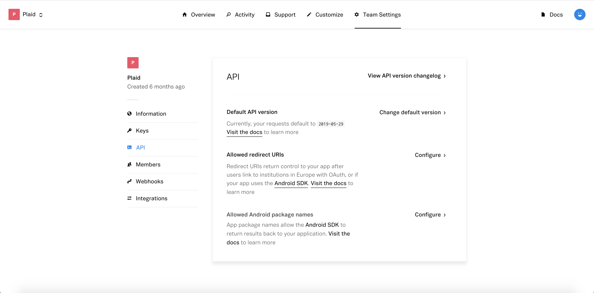

# Plaid Link plugin for Flutter

A Flutter plugin for [Plaid Link](https://github.com/plaid/link).

This plugin integrates the native SDKs:

- [Plaid Link iOS SDK](https://github.com/plaid/plaid-link-ios)
- [Plaid Link Android SDK](https://github.com/plaid/plaid-link-android)

*Note*: This plugin is still under development, and some APIs might not be available yet. Feedback and Pull Requests are most welcome!

## Installation

The plugin is not published yet. Add the package as a [git dependency in your pubspec.yaml](https://flutter.dev/docs/development/packages-and-plugins/using-packages#dependencies-on-unpublished-packages):

``` yaml
  plaid_flutter:
    git:
      url: https://github.com/jorgefspereira/plaid_flutter.git
``` 

### iOS

1. Add a Run Script build phase *(name it Prepare for Distribution for example)* with the script below. Be sure to run this build phase after the Embed Frameworks build phase (or [CP] Embed Pods Frameworks build phase when integrating using CocoaPods)

``` sh
LINK_ROOT=${PODS_ROOT:+$PODS_ROOT/Plaid}
cp "${LINK_ROOT:-$PROJECT_DIR}"/LinkKit.framework/prepare_for_distribution.sh "${CODESIGNING_FOLDER_PATH}"/Frameworks/LinkKit.framework/prepare_for_distribution.sh
"${CODESIGNING_FOLDER_PATH}"/Frameworks/LinkKit.framework/prepare_for_distribution.sh
```


*NOTE: More info at [https://github.com/plaid/link/ios](https://plaid.com/docs/link/ios).*

### Android

1. Add the LinkActivity activity and plaid_public_key metadata element to your AndroidManifest.xml within the application tag.

``` xml
<application>

  // ...

  <activity android:name="com.plaid.link.LinkActivity" />

  <meta-data android:name="com.plaid.link.public_key"
             android:value="@string/plaid_public_key" />

</application>
```

2. Add your plaid public key from the Plaid Dashboard to the donottranslate.xml file

``` xml
<string name="plaid_public_key">PUBLIC_KEY</string>
```

3. Log into your Plaid Dashboard at the API page and add a new Allowed Android package name *(for example com.plaid.example)* and a new Allowed redirect URI.


	
*NOTE: More info at [https://github.com/plaid/link/android](https://plaid.com/docs/link/android).*

## Usage Example

``` dart
import 'package:plaid_flutter/plaid_flutter.dart';

class MyApp extends StatefulWidget {
  @override
  _MyAppState createState() => _MyAppState();
}

class _MyAppState extends State<MyApp> {

  PlaidLink _plaidLink;
  
  @override
  void initState() {
    super.initState();
  
    _plaidLink = PlaidLink(
      clientName: "CLIENT_NAME",        //required
      publicKey: "PUBLIC_KEY",          //required
      oauthRedirectUri: "myapp://test", //required for android
      oauthNonce: "XXXXXXXXXXXXXXXX",   
      env: EnvOption.sandbox,
      products: <ProductOption>[
        ProductOption.auth,
      ],
      onAccountLinked: (publicToken, metadata) { print("onAccountLinked: $publicToken metadata: $metadata"); },
      onAccountLinkError: (error, metadata) { print("onAccountError: $error metadata: $metadata"); },
      onEvent: (event, metadata) { print("onEvent: $event metadata: $metadata"); },
      onExit: (metadata) { print("onExit: $metadata"); },
    );
  }

  @override
  Widget build(BuildContext context) {
    return MaterialApp(
      home: Scaffold(
        body: 
        Center( 
            child: 
            RaisedButton(
              onPressed: () {
                _plaidLink.open();
              },
              child: Text("Open Plaid Link"),
          	),
        ),
      ),
    );
  }
}
```

## TODOs

- [ ] [Avoid iOS Prepare for distribution configuration](https://plaid.com/docs/link/ios/#prepare-distribution-script)
- [ ] Implement tests
